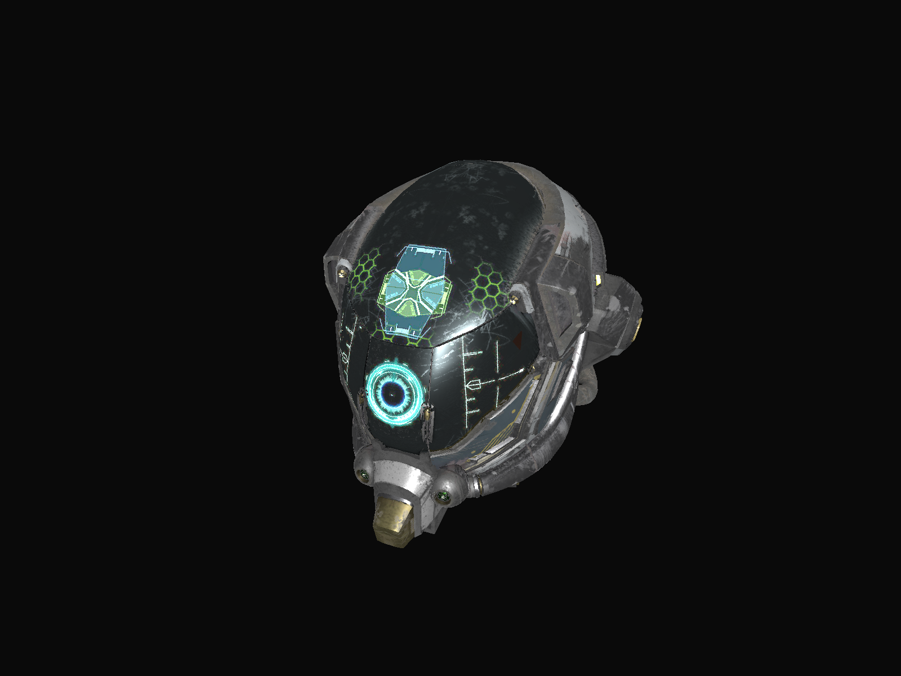

## What is this?
A simple shader based software renderer written in c that i wrote to experiment and learn more about 
rasterization algorithms and graphics pipelines.

<p align="center">  </p>
<p align="center">  </p>
<p align="center">  </p>

<br>

## Features
* Shader based 
* Configurable pipeline
* Blending
* Depth testing
* Texture sampling
* Perspective correct interpolation
* face culling
* ...

<br>

## Hello Triangle
Here is how you draw a simple triangle using the renderer

```cpp

struct Vertex {
    vec2 pos;
    vec2 uv;
};


struct Variant {
    vec2 uv;
};


sr_vec4 pixel_shader(SrVariant variants, SrGlobalRegistry* reg) {
    Variant* in = (Variant*)variants;

    return {in->uv.x, in->uv.y, 0.0f, 1.0f};
}


sr_vec4 vertex_shader(SrVertex in, SrVariant out, SrGlobalRegistry* reg) {
    Vertex* vertex = (Vertex*)in;

    Variant variant;
    variant.uv= vertex->uv;
    sr_upload_variant(out, variant);

    vec4 pos = vec4(vertex->pos, 0.0f, 1.0f);
    return {pos.x, pos.y, pos.z, pos.w};
}


int main(void) {

    window_handle = ...
    
    sr_context_init(window_handle);


    Vertex buff[] = {
        {{ 0.0f,  0.5f}, {0.5f, 1.0f}},
        {{-0.5f, -0.5f}, {0.0f, 0.0f}},
        {{ 0.5f, -0.5f}, {1.0f, 0.0f}},
    };

    SrFramebuffer framebuffer;
    SrPipeline pipeline;

    // creating the main framebuffer
    SrFramebufferSpec framebuffer_specs;
    framebuffer_specs.width  = width;
    framebuffer_specs.height = height;

    framebuffer = sr_framebuffer_create(framebuffer_specs);


    // creating the pipeline
    SrDepthInfo depth_info {};
    depth_info.depth_test_enabled  = false;

    SrRasterizerInfo rasterizer_info {};
    rasterizer_info.front_face   = SR_FRONT_FACE_COUNTER_CLOCKWISE;
    rasterizer_info.cull_mode    = SR_CULL_MODE_BACK_FACE;
    rasterizer_info.polygon_mode = SR_POLYGON_MODE_FILL;

    SrVertexInputInfo vertex_input_info {};
    vertex_input_info.byte_count = sizeof(Vertex);

    SrVariantsInfo variants_info {};
    variants_info.byte_count = sizeof(Variant);

    SrColorBlendInfo color_blend_info {};
    color_blend_info.blend_enabled    = false;

    SrPipelineSpec pipeline_specs {};
    pipeline_specs.primitve_type     = SR_PRIMITIVE_TYPE_TRIANGLE_LIST;
    pipeline_specs.depth_info        = depth_info;
    pipeline_specs.rasterizer_info   = rasterizer_info;
    pipeline_specs.vertex_input_info = vertex_input_info;
    pipeline_specs.variants_info     = variants_info;
    pipeline_specs.color_blend_info  = color_blend_info;
    pipeline_specs.framebuffer       = &framebuffer;
    pipeline_specs.vertex_shader     = &vertex_shader;
    pipeline_specs.pixel_shader      = &pixel_shader;


    pipeline = sr_create_pipeline(pipeline_specs);


    bool should_close= false;
    while (!should_close) {

        // clearing the framebuffer color
        sr_framebuffer_clear_color(&framebuffer, {0.04f, 0.04f, 0.04f, 1.0f});

        sr_draw(&pipeline, vertices_count, buff);

        sr_present(&pipeline);
    }

    // clean up
    sr_framebuffer_free(&framebuffer);
}
```

for more examples you can take a look at the samples in the samples folder

<br>


## How to use it?

1 - include "software_renderer.h" in your project and define __SOFTWARE_RENDERER_IMPLEMENTATION 
before including the file
2 - include your platform backend file from "backends" folder for presenting support


```c
#define __SOFTWARE_RENDERER_IMPLEMENTATION
#include "software_renderer.h"

#include "backends/win32_backend.h"
```

<br>


## Backends
The renderer doesn't provide a way to present into the screen by default 
but in the backends folder you can find some backends implementations
to help you presenting into the screen, for now I only support Win32 but 
will add support for other platforms later when i have time.


<br>


## Resources
For anyone who's interested in this stuff here is some resources that i found helpfull:
<br>


* For learning about different rasterization algorithms and their implementation
  I suggest Salem Haykal's master thesis he goes through different rasterization
  algorithms and how to implement and optimize them.
  https://www.digipen.edu/sites/default/files/public/docs/theses/salem-haykal-digipen-master-of-science-in-computer-science-thesis-an-optimized-triangle-rasterizer.pdf


* There is also a series of articles in "scratch a pixel" website that goes through 
  implementing a software renderer/rasterizer from scratch 
  https://www.scratchapixel.com/lessons/3d-basic-rendering/rasterization-practical-implementation/overview-rasterization-algorithm.html


* An overview of opengl transformations: http://www.songho.ca/opengl/gl_transform.html, 
  this a great article it explain the different transformations the vertex data goes
  through before the rasterization process, this article helped me a lot in designing 
  a good pipeline system.


* Opengl/Vulkan specs

<br>